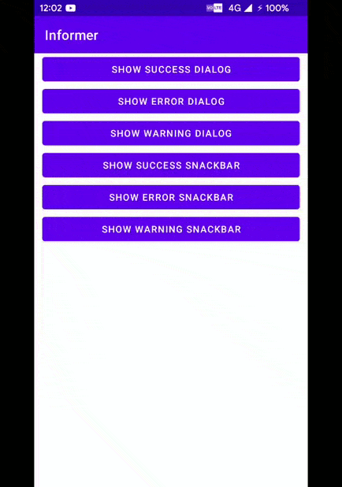
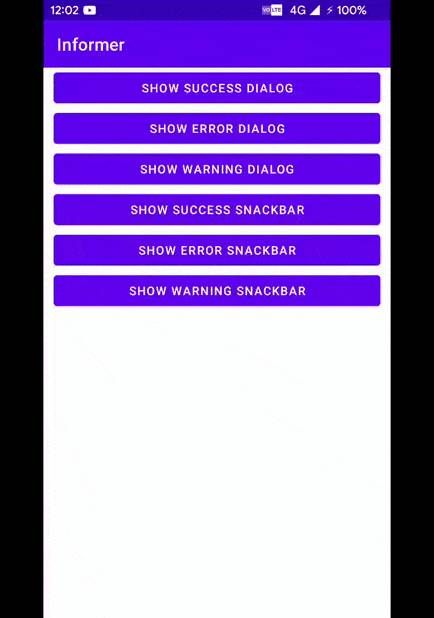

# PickMe
**This Libary helps you show common Dialog's & Snackbar's According to your needs. Ready to use in Any Project**
#### This Libary is under constant Updates.

## Features
- Make Custom Dialogs of three Types : Success , Error, Warning with the Custom Messages.
-  Make Custom SnackBars of Three Types : Success, Error, Warning with Custom Message of Error And Warning Snackbar showed in the dialog box upon the click of the button
-  More adding soon , Suggestions are welcomed !

**Screenshots of the Libary**

<table>
  <tr>
    <td>Dialogs Preview</td>
     <td>Snackbar Preview</td>
   </tr>
  <tr>
    <td></td>
    <td></td>
  </tr>
 </table>

------------

## Installation

##### Add  The jitpack repository inside the settings.fradle file of your project.

    dependencyResolutionManagement {
                repositoriesMode.set(RepositoriesMode.FAIL_ON_PROJECT_REPOS)
                repositories {
                    google()
                    mavenCentral()
                    jcenter() // Warning: this repository is going to shut down soon
                    maven { url "https://jitpack.io" }
                }
    }

------------

#####  Add the dependency inside the android project
            	        implementation 'com.github.RedEyesNCode:InformMe:1.0

------------

##### Usage

For showing the SuccessDialog
``redEyesNCode.initiateSuccessDialog(MainActivity.this,"Success !","This is a success dialog",false,false);``
For showing the ErrorDialog
``redEyesNCode.intiateErrorDialog(MainActivity.this,"Error !","This is a sample error Message !",true,true);``
For showing the Warning
``redEyesNCode.intiateWarningDialog(MainActivity.this,"Warning !","This is sample warning message !",true,true);``

**The Same Goes for the snackbars** see the MainActivity.java code & you will get there ;)

